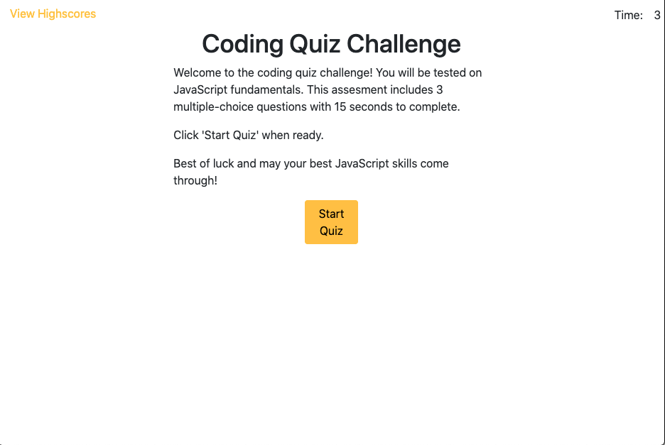

## week4-homework
# Coding Quiz Challenge

The coding quiz challenge tests the user on their Java Script knowledge by asking a series of questions on the subject. The benefit of this application for the user is that it provides a score at the end of the quiz, and on top of that
the option of having their score saved to a high scores list. 

The high scores list posts all participants scores and depending on the indivdual, whether they are a student or a senior programmer freshing up their prior knowledge may see their placement on the list in comparison to other quiz takers. 

## Motivation ✨
The overall motivation behind the development of this application was to be introduced to some JavaScript fundamentals that store user input for later display and comparison. In this instance storing quiz high scores and displaying them to the page for the client to see.

## Installation ✨
 For the development of the quiz application I started with what I was most comfortable in and that was the HTML and CSS file. Then, I moved forward to the quiz JavaScript with focus on getting the timer to function. 
 
 The challenge presented itself when I had to create a timer function that would count down consecutively, with out stop or restart, whenever the quiz changed to the next question. Once that was solved, the following challenge was aligning the multiple choice bubbles to the choices themselves. So a temporary solution to that is making a list of buttons and then placing each choice label within the button, instead aside from it. 

 For the future, I will create functional choice bubbles aligned with the content of the choices, more questions, and a high scores page.

## Screenshots ✨
#### Quiz Homepage:

## Links ✨